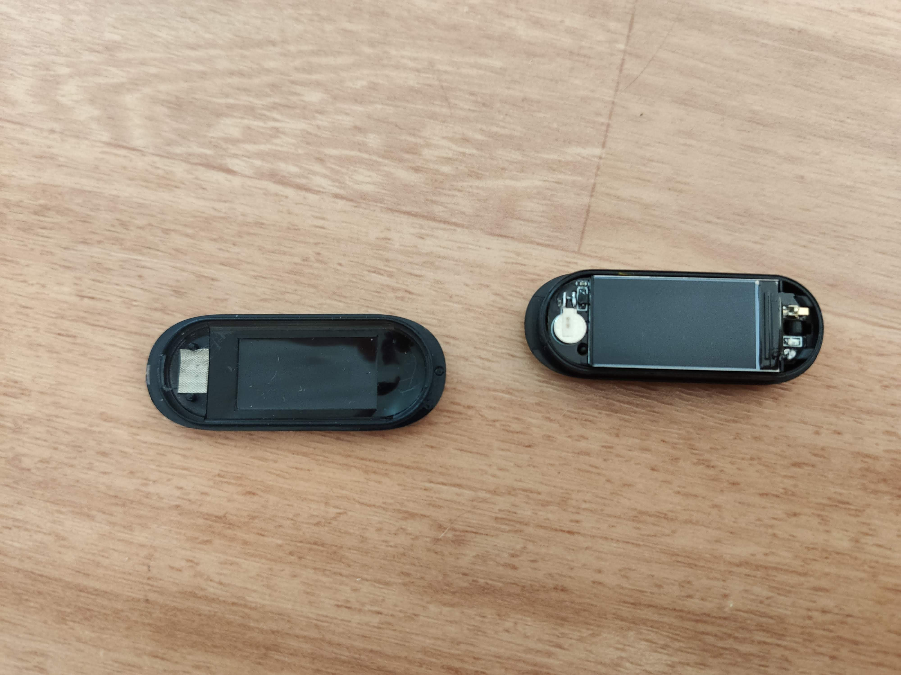

# LILYGO_T-Wristband-testing

Source code of the template copied from https://github.com/TioRuben/TTGO-T-Wristband. 

## Flashing your code
Projects are meant to be build with PlatformIO. 
Every project contains `platformio.ini` file with preconfigured enviroments.

### Upload via wired connection
First of all, you need to open wristbands screen case.
Start opening from the side with charging pads as shown in image below.

 

Now you need to gently pull PCB from its case at the side with RTC battery.

 

On the back side of the primary board (side with the battery) open the FPC line connector.

 

Connect daughter board with the FPC line to the primary board as shown on the third image.
Make sure, that FPC cable is oriented correctly (black side on top, side with visible contacts on the bottom).

 

Plug FPC in and close connector's latch.

 

Now connect daughter board to the computer with USB-C, or micro USB cable.

 

Your computer should immediately recognize your device and install drivers.
After successful driver installation you can start uploading your software.